---
title: "Example workflow: Getting organized using GitHub and RStudio"
author: "Olivier Binette"
output: 
     beamer_presentation:
      includes: 
          in_header: custom2.tex
font-size: 8px
---

# Agenda

- Getting set-up in RStudio
- Organizing your projects
- Using GitHub for project management

# 
\section{Getting set-up in RStudio}

# Getting set-up in RStudio

**Why use RStudio?**

- Convenient **git pane** to manage a git project (commit, push, pull, etc)

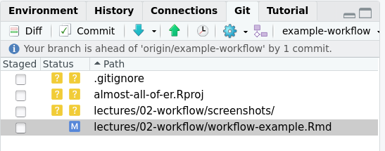

# Getting set-up in RStudio

**First step:** identify yourself using a SSH key

1. In RStudio, go to Tools -> Global Options... -> Git/SVN
2. Click the "Enable version control" box if it's not there already.

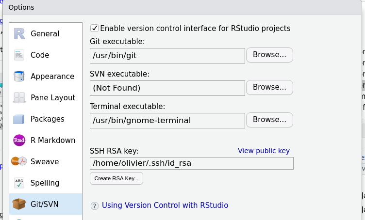

# Getting set-up in RStudio

3. Create a SSH RSA key

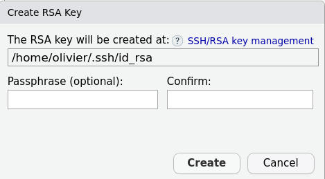

# Getting set-up in RStudio

4. Copy the key to your clipboard

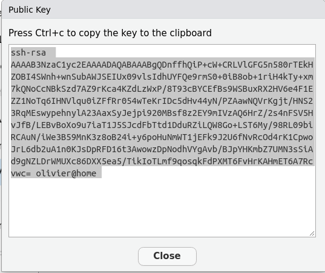

# Getting set-up in RStudio

4. Register the key on GitHub:
    - Under your account tab, got to Settings -> SSh and GPG keys -> New SSH key

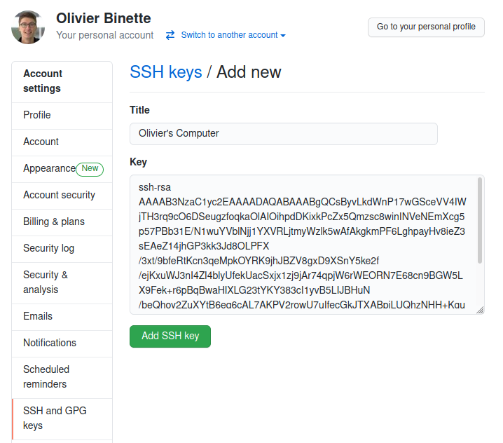

# Getting set-up in RStudio

5. GitHub can know recognize RStudio as being associated to your account!

Using RStudio's git pane, you can now:

- pull from the repo, commit your changes, and push your changes,

- create new branches.

# Getting set-up in RStudio

**Note: make sure to clone repos using SSH:**

1. Download ssh address

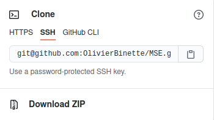

# Getting set-up in RStudio

2. Create a new project in RStudio using this ssh address
    - File -> New Project... -> Version Control -> Git 
    - Add the ssh address as the repository URL.

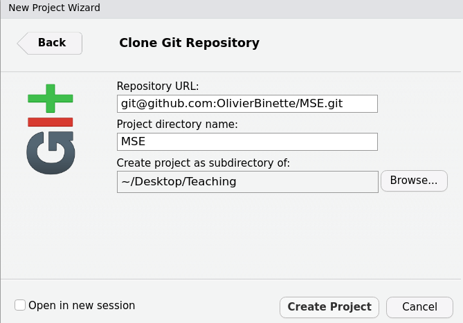

# 
\section{Organizing your project}

# Organizing your project

**Tip 1:** Create a **R/** folder where you put re-usable functions.

- Document these functions using Roxygen2 and devtools::document()
- Load all of these functions using devtools::load_all()
- Show examples of the use of these functions in Rmd files under a **vignettes** folder.

# Organizing your project

**Tip 2:** Have a single place where your put your reproducible analyses.

- Create an "analyses" folder where all reproducible analyses are contained.

- Each analysis is in its own subfolder.

- Each analysis contains the folders **input**, **src**, and **output**. 
    - **input** is never changed
    - running the the code in **src** together with what you need in **input** always creates the same result in **output**.

# Organizing your project

**Tip 3:** It's ok to mess up!

- Create an **experiments** folder where you can put... well, your failable experiments.

# Organizing your project

**Tip 4:** You'll need to write that up.

- Create a **writeup** folder where you put your TeX writeups.

# Organizing your project

**Tip 5:** Avoid file path issues using the "here" package.

- Place an empty file named ".here" at the project root.
- Using there "here" package, you can obtain the path to the project root by calling the function here().
- Refer to project files using e.g. here("R/my_code.R")

This avoids common issues related to file paths using R/RStudio. 

# Organizing your project

Overall, you project could be structured like this:

- .here
- **R/**
- **vignettes/**
- **experiments/**
    - olivier's-buggy-code.Rmd
- **analyses/**
    - **PCA/**
        - **input/**: data.rds
        - **src/**: 1-parse-data.R, 2-PCA.R, 3-make-plots.R
        - **output/**: pca-results.rds, plot.pdf
- **writeup/**
    - main.tex
    - biblio.bib
    
# Organizing your project

**Tip 6:** Want to avoid merge conflicts?

- Branch off!

- Tweak that analysis in a new branch. Once you and your team is happy with the changes, you can make a pull request to merge back the changes.

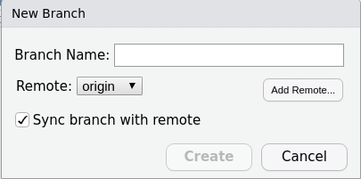

# 
\section{Project management using GitHub}

# Project management using GitHub

1. Break up your project into a set of milestones

2. Break up the milestones into tasks/todos.

# Project management using GitHub

3. List each task as an "Issue" on GitHub (the name "Issue" refers to tasks, todos, bugs, etc)

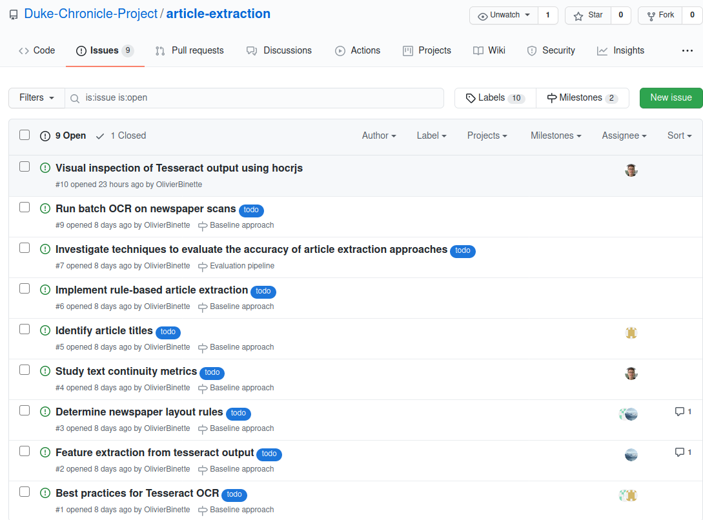

# Project management using GitHub

4. Assign the issues to team members, document progress, and close the issue when you're done.

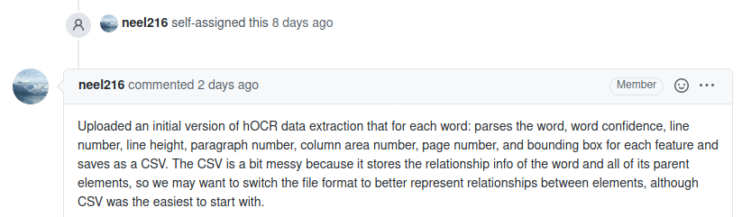

# Project management using GitHub

5. **Want more?** 
    - Use the "Projects" pane on GitHub to create one project Kanban board for each milestone. 
    - Track which tasks are being worked on by using the "In Progress" list.

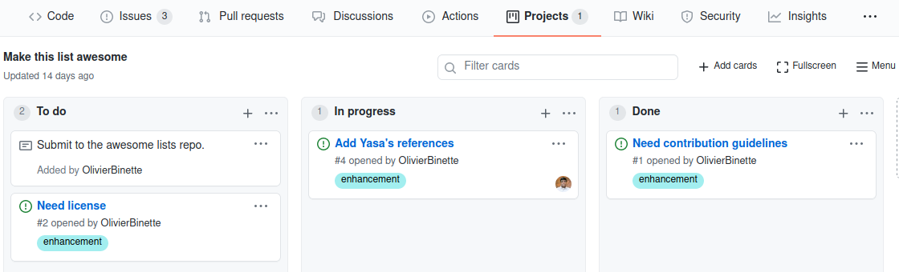

# 
\section{Summary}

- RStudio's git pane is convenient. Make sure to set up SSH.
- Agree on a clear folder structure for your repo.
- Use GitHub Issues to define tasks and to document progress.

